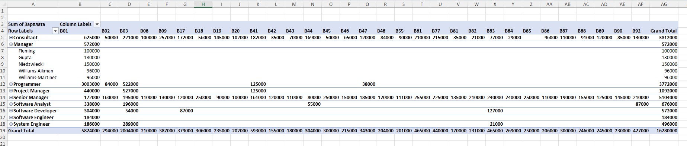
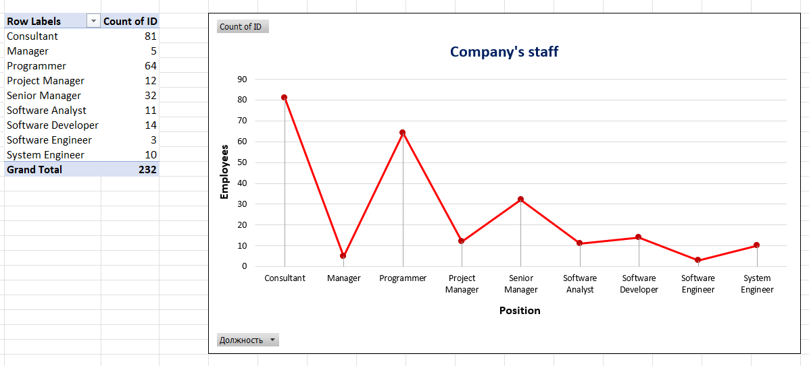
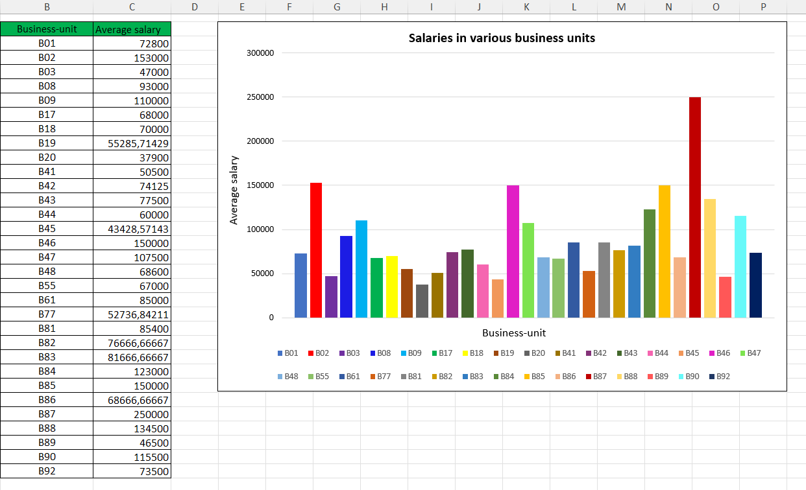
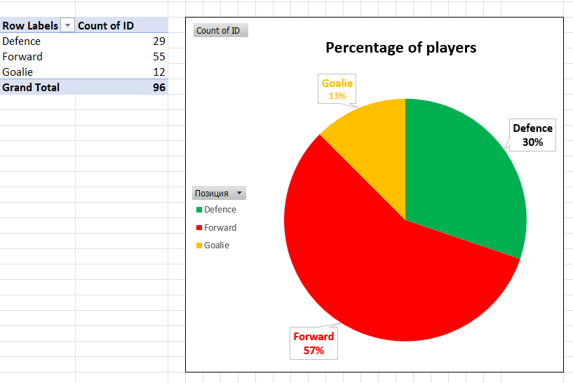
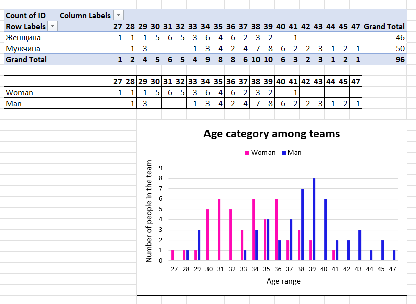

# Excel_data_analysis
Excel-проект по обработке данных. Данные были очищены от дубликатов и пропусков. Использованы функции СЦЕПИТЬ, ВПР, ЕСЛИ, СУММЕСЛИ, СЧЕТЕСЛИМН, МАКС, МИН. Построены сводные таблицы и 4 типа графиков на основе двух наборов данных.

